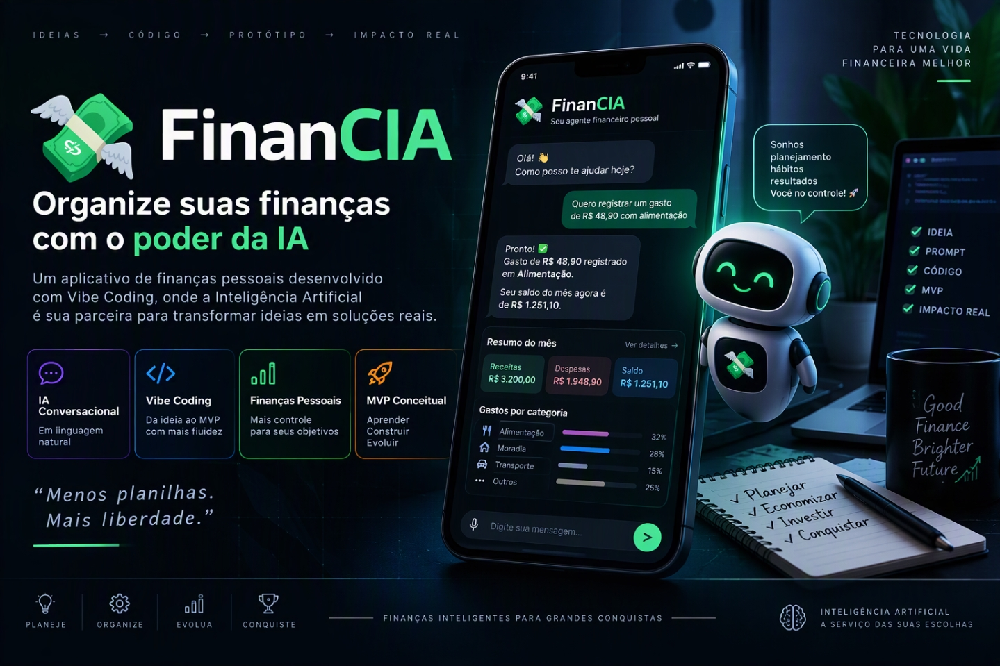

  

  
  
  
  
  

# 💸 FinanCIA — App de Organização de Finanças Pessoais com Vibe Coding

> **AI Engineer | Especialista em Governança 4.0 e Qualidade | Engenheiro Químico**  
> [Mauá, SP](mailto:ornelas.tozato@gmail.com) | [LinkedIn](https://www.linkedin.com/in/rafaeltozato81) | [GitHub](https://github.com/Rafael-TOZATO) | [Portfólio PWA](https://tozato-dev-hub.vercel.app) | [Medium](https://medium.com/@ornelas.tozato)

> Projeto desenvolvido como parte do desafio App de Organização de Finanças Pessoais com Vibe Coding, utilizando IA como parceira para transformar uma ideia de produto em um conceito de MVP.

---

## 📌 Sobre o projeto

O FinanCIA é um conceito de aplicativo de organização financeira pessoal orientado por conversação. A proposta é reduzir a dependência de formulários, planilhas e lançamentos manuais, permitindo que o usuário registre movimentações e consulte sua situação financeira utilizando linguagem natural.

O conceito utiliza um Agente Financeiro para interpretar informações, organizar transações, acompanhar objetivos e apresentar orientações de economia de maneira educativa e personalizada.

O projeto segue a abordagem de Vibe Coding: primeiro definir claramente o problema, o público, as funcionalidades e o comportamento esperado; depois utilizar ferramentas de IA para explorar a solução, o fluxo de telas e o MVP.

---

## 🎯 Problema

Muitas pessoas têm dificuldade para manter uma rotina de organização financeira porque o processo tradicional exige registros manuais, categorização de despesas e acompanhamento constante.

O objetivo do conceito é tornar essa interação mais simples:

> usuário conversa → IA interpreta → dados são organizados → objetivos são acompanhados → informações são apresentadas de forma simples.

---

## 👥 Público-alvo

- Pessoas que estão começando a organizar a vida financeira.
- Usuários que desejam reduzir o uso de planilhas e controles manuais.
- Pessoas que preferem interações conversacionais.
- Usuários que querem acompanhar metas financeiras de forma simples.

---

## 🧠 PRD — Product Requirements Document

### Contexto
Quero criar um aplicativo chamado FinanCIA, voltado à organização de finanças pessoais e baseado em interação conversacional. A experiência deve permitir que o usuário registre receitas e despesas utilizando linguagem natural, consulte sua situação financeira, defina metas e receba orientações personalizadas de organização e economia.

### Problema
O controle financeiro tradicional pode exigir muitos lançamentos manuais, categorização de transações e atualização constante de planilhas. O FinanCIA deve transformar esse processo em uma experiência mais natural, utilizando IA para interpretar as informações fornecidas pelo usuário e organizar os dados de forma estruturada.

### Objetivos do produto
1. Facilitar o registro de receitas e despesas.
2. Reduzir a necessidade de categorização manual.
3. Permitir definição e acompanhamento de metas financeiras.
4. Oferecer uma visão simples da situação financeira.
5. Utilizar IA para gerar orientações personalizadas de organização e economia.

### Funcionalidades-chave
1. **Registro por linguagem natural:** O usuário informa movimentações em linguagem cotidiana (ex: *"Gastei R$ 85 no supermercado hoje"*).
2. **Classificação automática:** Categorização automática em Alimentação, Transporte, Moradia, Saúde, Lazer, Educação, Outros.
3. **Metas financeiras:** Criação e acompanhamento de objetivos por meio de conversas.
4. **Agente Financeiro:** Assistente conversacional inteligente que interpreta mensagens, analisa dados, orienta o usuário e mantém total transparência (sem solicitar senhas ou dados sensíveis).
5. **Relatórios simples:** Visão visual e objetiva de entradas, saídas, saldo, categorias e metas.

---

## 🖥️ Fluxo de Telas e MVP
* **Dashboard:** Visão geral da situação financeira (saldo, entradas, saídas e metas).
* **Agente Financeiro:** Interface de chat conversacional.
* **Movimentações:** Histórico detalhado com filtros.
* **Metas:** Acompanhamento de prazos e valores desejados.
* **Relatórios:** Evolução de receitas e despesas.

---

## Autor

**Rafael Ornelas Tozato**

Engenharia Química | Garantia da Qualidade | Governança 4.0

### Contato

- LinkedIn: [linkedin.com/in/rafaeltozato81](https://www.linkedin.com/in/rafaeltozato81)
- GitHub: [github.com/Rafael-TOZATO](https://github.com/Rafael-TOZATO)
- Medium: [medium.com/@ornelas.tozato](https://medium.com/@ornelas.tozato)
- Portfólio PWA: [tozato-dev-hub.vercel.app](https://tozato-dev-hub.vercel.app)
- DIO: [web.dio.me/users/ornelas_tozato](https://web.dio.me/users/ornelas_tozato)
a demonstração e não inclua integrações bancárias reais.

Organize o resultado considerando funcionalidades prioritárias, recursos necessários e critérios de validação.

Prompt de refinamento

Aprimore o conceito do FinanCIA mantendo o foco em simplicidade, linguagem natural e organização financeira pessoal.

Melhore a experiência do Agente Financeiro, o fluxo de telas e a apresentação das informações.

Evite funcionalidades desnecessárias para o MVP e mantenha o projeto adequado para uma demonstração conceitual utilizando dados fictícios.

---

🧪 Evidências do processo

As imagens abaixo documentam o protótipo desenvolvido com o Lovable, incluindo as principais telas e funcionalidades exploradas durante o processo de Vibe Coding.

Dashboard — visão geral

"Dashboard FinanCIA" (assets/lovable/dashboard-financia-visao-geral.png)

Agente Financeiro

"Agente Financeiro" (assets/lovable/agente-financeiro.png)

Movimentações

"Movimentações Financeiras" (assets/lovable/movimentacoes-financeiras.png)

Metas Financeiras

"Metas Financeiras" (assets/lovable/metas-financeiras.png)

Dashboard Analítico — Relatórios

"Relatórios Financeiros" (assets/lovable/dashboard-analitico-financeiro.png)

Evidências — Copilot

A etapa de refinamento dos prompts com o Microsoft Copilot faz parte do processo de desenvolvimento e será documentada com os respectivos registros visuais das interações.

---

📚 Reflexão sobre o processo

O desenvolvimento do FinanCIA demonstrou como ferramentas de Inteligência Artificial podem atuar como parceiras durante as diferentes etapas de concepção de um produto digital.

O processo começou pela definição do problema e das necessidades do usuário. Em seguida, os requisitos foram organizados em um PRD simplificado, permitindo transformar a ideia inicial em uma especificação mais estruturada.

A utilização do Vibe Coding possibilitou explorar a solução por meio de linguagem natural, utilizando prompts para orientar a criação do conceito, do fluxo de telas e das funcionalidades do MVP.

O uso do Lovable permitiu transformar os requisitos em uma representação visual do produto, facilitando a validação da estrutura e da experiência proposta.

Um dos principais aprendizados foi perceber que a qualidade do resultado depende diretamente da clareza do contexto, dos requisitos e das instruções fornecidas às ferramentas de IA.

Também ficou evidente que a IA funciona melhor como parceira de desenvolvimento e exploração quando existe uma definição clara do problema, do público e dos objetivos do produto.

---

✅ Resultado

O resultado é um conceito de MVP chamado FinanCIA, estruturado para demonstrar uma experiência de organização financeira pessoal baseada em conversação.

O projeto contempla:

- PRD estruturado.
- Agente Financeiro.
- Registro por linguagem natural.
- Classificação automática.
- Metas financeiras.
- Dashboard.
- Movimentações.
- Relatórios.
- Plano de MVP.
- Prompts utilizados durante o processo.
- Protótipo visual desenvolvido com Lovable.
- Evidências visuais das principais telas.

O projeto demonstra, na prática, como o Vibe Coding pode ser utilizado para transformar uma ideia inicial em uma proposta de produto estruturada utilizando ferramentas de Inteligência Artificial.

---

🔗 Repositório

Este projeto está disponível publicamente no GitHub:

https://github.com/Rafael-TOZATO/dio-lab-vibe-coding-app-financas

---

📝 Observação

Este projeto foi desenvolvido como atividade prática do desafio App de Organização de Finanças Pessoais com Vibe Coding da DIO.

A proposta é educacional e conceitual, utilizando dados fictícios para demonstração. Não representa uma aplicação financeira conectada a instituições bancárias reais.
